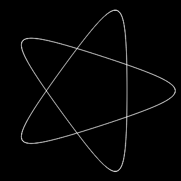

 &nbsp;&nbsp;&nbsp;&nbsp;&nbsp;&nbsp;&nbsp;&nbsp;&nbsp;&nbsp; [ reply.it](https://repl.it/repls/folder/PyGame%20Examples)

"Scepticism is the first step towards truth."  
Denis Diderot, Pensées philosophiques

---

# Draw 2D

## Water effects

Related Stack Overflow questions:

- [Water ripple effect Python and Pygame, from coding train video](https://stackoverflow.com/questions/60336688/water-ripple-effect-python-and-pygame-from-coding-train-video/60337269#60337269)  
  
  📁 **[Minimal example - Water ripple effect](../../examples/minimal_examples/pygame_minimal_2D_water_ripple_effect.py)**

  

  📁 **[Minimal example - Water ripple effect using NumPy](../../examples/minimal_examples/pygame_minimal_2D_water_ripple_effect_numpy.py)**

  

## Particles

Related Stack Overflow questions:

- [Pygame change particle color](https://stackoverflow.com/questions/60944070/pygame-change-particle-color/60953697#60953697)  
  

  📁 **[Minimal example - Spraying particles](../../examples/minimal_examples/pygame_minimal_2D_particles.py)**

  **[ repl.it/@Rabbid76/PyGame-BarnsleysFern](https://replit.com/@Rabbid76/PyGame-BarnsleysFern#main.py)**

- [Create trails of particles for the bullets](https://stackoverflow.com/questions/72643317/create-trails-of-paticles-for-the-bullets/72644068#72644068)  
  

  📁 **[Minimal example - Rocket particles](../../examples/minimal_examples/pygame_minimal_2D_rocket_particles.py)**

- [Creating class objects at random from a list in pygame](https://stackoverflow.com/questions/73708646/creating-class-objects-at-random-from-a-list-in-pygame/73708729#73708729)

## String

Related Stack Overflow questions:

- [Simple physics string](https://stackoverflow.com/questions/41862541/simple-physics-string/67749043#67749043)  
  

  📁 **[Minimal example - String animation](../../examples/minimal_examples/pygame_minimal_2D_string_animation.py)**

## Fractal

Related Stack Overflow questions:

- [Having issues trying to use a dictionary to define parameters for Barnsley's Fern](https://stackoverflow.com/questions/56913062/having-issues-trying-to-use-a-dictionary-to-define-parameters-for-barnsleys-fer)  
  

  📁 **[Minimal example - Barnsley's Fern](../../examples/minimal_examples/pygame_minimal_2D_barnsleys_fern.py)**

- [Is there anyway to do this recursively in pygame?](https://stackoverflow.com/questions/59455641/is-there-anyway-to-do-this-recursively-in-pygame/59456232#59456232)  
- 

  📁 **[Minimal example - Recursive circles](../../examples/minimal_examples/pygame_minimal_2D_recursive_circles.py)**

- [Recursive Fractal Pygame - Not Displaying Shapes](https://stackoverflow.com/questions/30140671/recursive-fractal-pygame-not-displaying-shapes/69036894#69036894)  
    

  📁 **[Minimal example - Fractal Sierpinski Carpet](../../examples/minimal_examples/pygame_minimal_2D_fractal_sierpinski_carpet.py)**

## Lookup table

Related Stack Overflow questions:

- [use a color lookup table with pygame](https://stackoverflow.com/questions/63748651/use-a-color-lookup-table-with-pygame/64198152#64198152)

  📁 **[Minimal example - Lookup table](../../examples/minimal_examples/pygame_minimal_2D_lookup_table.py)**

## Triangulation

Related Stack Overflow questions:

- [A Bowyer-Watson Delaunay Triangulation I implemented doesn't remove the triangles that contain points of the super-triangle](https://stackoverflow.com/questions/58116412/a-bowyer-watson-delaunay-triangulation-i-implemented-doesnt-remove-the-triangle/58122991#58122991)  
  

  📁 **[Minimal example - Bowyer-Watson Delaunay Triangulation 1](../../examples/minimal_examples/pygame_minimal_2D_bowyer_watson_delyunay_triangulation_1.py)**

- [Bowyer-Watson triangulates incorrectly when trying to implement circumcircle calculation for vertices at infinity](https://stackoverflow.com/questions/58203812/bowyer-watson-triangulates-incorrectly-when-trying-to-implement-circumcircle-cal/58205019#58205019)  
  

  📁 **[Minimal example - Bowyer-Watson Delaunay Triangulation 2](../../examples/minimal_examples/pygame_minimal_2D_bowyer_watson_delyunay_triangulation_2.py)**

## Recaman's sequence

Related Stack Overflow questions:

- [Trying to code the Recaman Sequence, but issue with the parameters I pass for drawing an arc](https://stackoverflow.com/questions/54384422/trying-to-code-the-recaman-sequence-but-issue-with-the-parameters-i-pass-for-dr/54386695#54386695)  
  

  📁 **[Minimal example - Recaman's sequence](../../examples/minimal_examples/pygame_minimal_2D_racamans_sequence.py)**

## Hypotrochoid

📁 **[Minimal example - Hypotrochoid](../../examples/minimal_examples/pygame_minimal_2D_hypotrochoid.py)**

## Glow, bloom, neon, cv2

Related Stack Overflow questions:

- [Neon effect in pygame?](https://stackoverflow.com/questions/67933919/neon-effect-in-pygame/67934335#67934335)  
  

- [Bloom Effect in Pygame so that text glows](https://stackoverflow.com/questions/67561142/bloom-effect-in-pygame-so-that-text-glows)

- [Surface alpha lost when converting pygame to cv2 to pygame](https://stackoverflow.com/questions/69888520/surface-alpha-lost-when-converting-pygame-to-cv2-to-pygame/69888915#69888915)  
    
- [Dark borders in cv2.blur](https://stackoverflow.com/questions/69977901/dark-borders-in-cv2-blur/69981313#69981313)  
  

  📁 **[Minimal example - Bloom](../../examples/minimal_examples/pygame_minimal_2D_bloom.py)**
