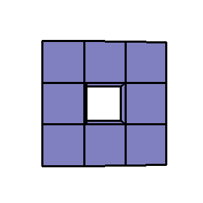

 &nbsp;&nbsp;&nbsp;&nbsp;&nbsp;&nbsp;&nbsp;&nbsp;&nbsp;&nbsp; [ reply.it](https://repl.it/repls/folder/PyGame%20Examples)

---

# Draw 3D

Related Stack Overflow questions:

- [Pygame rotating cubes around axis](https://stackoverflow.com/questions/56285017/pygame-rotating-cubes-around-axis/56286203#56286203)  
  
- [Depth issue with 3D graphics](https://stackoverflow.com/questions/59690079/depth-issue-with-3d-graphics/59692739#59692739)  
  
- [Close range 3d display messed up](https://stackoverflow.com/questions/60330496/close-range-3d-display-messed-up/60335112#60335112)  
  
- [How to rotate a square around x-axis in a 3D space](https://stackoverflow.com/questions/63651594/how-to-rotate-a-square-around-x-axis-in-a-3d-space/63654537#63654537)  
  
- [Pygame's rect.clip function in 3D](https://stackoverflow.com/questions/56079522/pygames-rect-clip-function-in-3d/56080083#56080083)
- [How to improve my simulation of 3d space in pygame?](https://stackoverflow.com/questions/58674461/how-to-improve-my-simulation-of-3d-space-in-pygame/58675007#58675007)  
  

:scroll: **[Minimal example - 3D depth sort 1](../../examples/minimal_examples/pygame_minimal_3D_depth_sort_1.py)**

<kbd>[ repl.it/@Rabbid76/PyGame-3D](https://repl.it/@Rabbid76/PyGame-3D#main.py)</kbd>

