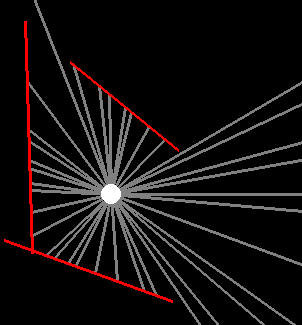

[](https://stackoverflow.com/users/5577765/rabbid76?tab=profile) &nbsp;&nbsp;&nbsp;&nbsp;&nbsp;&nbsp;&nbsp;&nbsp;&nbsp;&nbsp; [ reply.it](https://repl.it/repls/folder/PyGame%20Examples)

"I'm a programmer. I like programming. And the best way I've found to have a positive impact on code is to write it."  
Robert C. Martin, Clean Architecture

---

For the computation of a reflection vector see [Vector - Reflection](pygame_vector_and_reflection.md).

# Collision and Intersection

## Overview

Related Stack Overflow questions:

- **[How do I detect collision in pygame?](https://stackoverflow.com/questions/29640685/how-do-i-detect-collision-in-pygame/65064907#65064907)**  

- [How do you program collision in classes?](https://stackoverflow.com/questions/69331228/how-do-you-program-collision-in-classes/69332148#69332148)  
  

- **[How to detect collisions between two rectangular objects or images in pygame](https://stackoverflow.com/questions/63561028/how-to-detect-collision-between-two-images-in-pygame/63561152#63561152)**

- [Is there a class in pygame to represent a non-AABB polygon?](https://stackoverflow.com/questions/68718593/is-there-a-class-in-pygame-to-represent-a-non-aabb-polygon/68718661#68718661)  

In PyGame, basic collision detection can be done using [`pygame.Rect`](https://www.pygame.org/docs/ref/rect.html) objects. The `Rect` object offers various methods for detecting collisions between objects. Note that even the collision of a rectangular object with a circular object such as a paddle and a ball in _Pong_ game can be roughly detected by a collision between two rectangular objects, the paddle and the bounding rectangle of the ball.

Some examples:

- [`pygame.Rect.collidepoint`](https://stackoverflow.com/questions/29640685/how-do-i-detect-collision-in-pygame/65064907#65064907):
  
  > Test if a point is inside a rectangle

  :scroll: **[Minimal example - collidepoint](../../examples/minimal_examples/pygame_minimal_rectangle_collidepoint.py)**

  

  **[ repl.it/@Rabbid76/PyGame-collidepoint](https://replit.com/@Rabbid76/PyGame-collidepoint#main.py)**

  ```py
  import pygame

  pygame.init()
  window = pygame.display.set_mode((250, 250))
  rect = pygame.Rect(*window.get_rect().center, 0, 0).inflate(100, 100)

  run = True
  while run:
      for event in pygame.event.get():
          if event.type == pygame.QUIT:
              run = False

      point = pygame.mouse.get_pos()
      collide = rect.collidepoint(point)
      color = (255, 0, 0) if collide else (255, 255, 255)

      window.fill(0)
      pygame.draw.rect(window, color, rect)
      pygame.display.flip()

  pygame.quit()
  exit()
  ```

- [`colliderect`](https://www.pygame.org/docs/ref/rect.html#pygame.Rect.colliderect)

  > Test if two rectangles overlap

  :scroll: **[Minimal example - collidepoint](../../examples/minimal_examples/pygame_minimal_rectangle_colliderect.py)**

  **[ repl.it/@Rabbid76/PyGame-colliderect](https://replit.com/@Rabbid76/PyGame-colliderect#main.py)**

  

  ```py
  import pygame

  pygame.init()
  window = pygame.display.set_mode((250, 250))
  rect1 = pygame.Rect(*window.get_rect().center, 0, 0).inflate(75, 75)
  rect2 = pygame.Rect(0, 0, 75, 75)

  run = True
  while run:
      for event in pygame.event.get():
          if event.type == pygame.QUIT:
              run = False

      rect2.center = pygame.mouse.get_pos()
      collide = rect1.colliderect(rect2)
      color = (255, 0, 0) if collide else (255, 255, 255)

      window.fill(0)
      pygame.draw.rect(window, color, rect1)
      pygame.draw.rect(window, (0, 255, 0), rect2, 6, 1)
      pygame.display.flip()

  pygame.quit()
  exit()
  ```

Furthermore [`pygame.Rect.collidelist`](https://www.pygame.org/docs/ref/rect.html#pygame.Rect.collidelist) and [`pygame.Rect.collidelistall`](https://www.pygame.org/docs/ref/rect.html#pygame.Rect.collidelistall) can be used for the collision test between a rectangle and a list of rectangles. [`pygame.Rect.collidedict`](https://www.pygame.org/docs/ref/rect.html#pygame.Rect.collidedict) and [`pygame.Rect.collidedictall`](https://www.pygame.org/docs/ref/rect.html#pygame.Rect.collidedictall) can be used for the collision collision test between a rectangle and a dictionary of rectangles.

The collision of [`pygame.sprite.Sprite`](https://www.pygame.org/docs/ref/sprite.html#pygame.sprite.Sprite) and [`pygame.sprite.Group`](https://www.pygame.org/docs/ref/sprite.html#pygame.sprite.Group) objects, can be detected by [`pygame.sprite.spritecollide()`](https://www.pygame.org/docs/ref/sprite.html#pygame.sprite.spritecollide), [`pygame.sprite.groupcollide()`](https://www.pygame.org/docs/ref/sprite.html#pygame.sprite.groupcollide) or [`pygame.sprite.spritecollideany()`](https://www.pygame.org/docs/ref/sprite.html#pygame.sprite.spritecollideany). When using these methods, the collision detection algorithm can be specified by the `collided` argument:

> The collided argument is a callback function used to calculate if two sprites are colliding.

Possible `collided` callables are [`collide_rect`](https://www.pygame.org/docs/ref/sprite.html#pygame.sprite.collide_rect), [`collide_rect_ratio`](https://www.pygame.org/docs/ref/sprite.html#pygame.sprite.collide_rect_ratio), [`collide_circle`](https://www.pygame.org/docs/ref/sprite.html#pygame.sprite.collide_circle), [`collide_circle_ratio`](https://www.pygame.org/docs/ref/sprite.html#pygame.sprite.collide_circle_ratio), [`collide_mask`](https://www.pygame.org/docs/ref/sprite.html#pygame.sprite.collide_mask)

Some examples:

- [`pygame.sprite.spritecollide()`](https://www.pygame.org/docs/ref/sprite.html#pygame.sprite.spritecollide)

  :scroll: **[Minimal example - collidepoint](../../examples/minimal_examples/pygame_minimal_rectangle_spritecollide.py)**

  **[ repl.it/@Rabbid76/PyGame-spritecollide](https://replit.com/@Rabbid76/PyGame-spritecollide#main.py)**

  

  ```py
  import pygame

  pygame.init()
  window = pygame.display.set_mode((250, 250))

  sprite1 = pygame.sprite.Sprite()
  sprite1.image = pygame.Surface((75, 75))
  sprite1.image.fill((255, 0, 0))
  sprite1.rect = pygame.Rect(*window.get_rect().center, 0, 0).inflate(75, 75)
  sprite2 = pygame.sprite.Sprite()
  sprite2.image = pygame.Surface((75, 75))
  sprite2.image.fill((0, 255, 0))
  sprite2.rect = pygame.Rect(*window.get_rect().center, 0, 0).inflate(75, 75)

  all_group = pygame.sprite.Group([sprite2, sprite1])
  test_group = pygame.sprite.Group(sprite2)

  run = True
  while run:
      for event in pygame.event.get():
          if event.type == pygame.QUIT:
              run = False

      sprite1.rect.center = pygame.mouse.get_pos()
      collide = pygame.sprite.spritecollide(sprite1, test_group, False)

      window.fill(0)
      all_group.draw(window)
      for s in collide:
          pygame.draw.rect(window, (255, 255, 255), s.rect, 5, 1)
      pygame.display.flip()

  pygame.quit()
  exit()
  ```

- [`pygame.sprite.spritecollide()`](https://www.pygame.org/docs/ref/sprite.html#pygame.sprite.spritecollide) / [`collide_circle`](https://www.pygame.org/docs/ref/sprite.html#pygame.sprite.collide_circle)

  :scroll: **[Minimal example - collidepoint](../../examples/minimal_examples/pygame_minimal_intersect_spritecollide_collide_circle.py)**

  **[ repl.it/@Rabbid76/PyGame-spritecollidecollidecircle](https://replit.com/@Rabbid76/PyGame-spritecollidecollidecircle#main.py)**

  

  ```py
  import pygame

  pygame.init()
  window = pygame.display.set_mode((250, 250))

  sprite1 = pygame.sprite.Sprite()
  sprite1.image = pygame.Surface((80, 80), pygame.SRCALPHA)
  pygame.draw.circle(sprite1.image, (255, 0, 0), (40, 40), 40)
  sprite1.rect = pygame.Rect(*window.get_rect().center, 0, 0).inflate(80, 80)
  sprite1.radius = 40
  sprite2 = pygame.sprite.Sprite()
  sprite2.image = pygame.Surface((80, 89), pygame.SRCALPHA)
  pygame.draw.circle(sprite2.image, (0, 255, 0), (40, 40), 40)
  sprite2.rect = pygame.Rect(*window.get_rect().center, 0, 0).inflate(80, 80)
  sprite2.radius = 40

  all_group = pygame.sprite.Group([sprite2, sprite1])
  test_group = pygame.sprite.Group(sprite2)

  run = True
  while run:
      for event in pygame.event.get():
          if event.type == pygame.QUIT:
              run = False

      sprite1.rect.center = pygame.mouse.get_pos()
      collide = pygame.sprite.spritecollide(sprite1, test_group, False, pygame.sprite.collide_circle)

      window.fill(0)
      all_group.draw(window)
      for s in collide:
          pygame.draw.circle(window, (255, 255, 255), s.rect.center, s.rect.width // 2, 5)
      pygame.display.flip()

  pygame.quit()
  exit()
  ```

## Collide with frame, window border (boundaries) and restrict to rectangle

Related Stack Overflow questions:

- [Setting up an invisible boundary for my sprite](https://stackoverflow.com/questions/69180916/setting-up-an-invisible-boundary-for-my-sprite/69181366#69181366)  
    

  :scroll: **[Minimal example - Restrict rectangle to frame](../../examples/minimal_examples/pygame_minimal_intersect_frame_clamp_1.py)**

- [How to collide with the window frame, bounce the ball and restrict the ball to the rectangular area?](https://stackoverflow.com/questions/60213103/how-to-collide-with-the-window-frame-bounce-the-ball-and-restrict-the-ball-to-t/60214064#60214064)  
    
- [How to make ball bounce off wall with Pygame?](https://stackoverflow.com/questions/59802794/how-to-make-ball-bounce-off-wall-with-pygame/59803018#59803018)  
  
- [Create a border in PyGame](https://stackoverflow.com/questions/74195841/create-a-border-in-pygame/74195933#74195933)
- [Window border in pygame](https://stackoverflow.com/questions/64205777/window-border-in-pygame/64206877#64206877)
- [I made a border in this pong game, but the paddles can cross it. How do I stop that?](https://stackoverflow.com/questions/63607681/i-made-a-border-in-this-pong-game-but-the-paddles-can-cross-it-how-do-i-stop-t/63609229#63609229)  
- [How do you get pygame to give warning when player touches side of screen?](https://stackoverflow.com/questions/65279570/how-do-you-get-pygame-to-give-warning-when-player-touches-side-of-screen/65279636#65279636)  
- [Colour Changing Bouncing Ball](https://stackoverflow.com/questions/60312365/colour-changing-bouncing-ball/60315375#60315375)  
    
- [how to keep polygon in screen in pygame?](https://stackoverflow.com/questions/75092185/how-to-keep-polygon-in-screen-in-pygame/75092354#75092354)  

:scroll: **[Minimal example - Restrict circle to frame](../../examples/minimal_examples/pygame_minimal_intersect_frame_clamp_2.py)**

:scroll: **[Minimal example - Let a ball bounce off floor](../../examples/minimal_examples/pygame_minimal_intersect_circle_floor.py)**

PyGame has a feature that does exactly what you want it to do. Use [`pygame.Rect`](https://www.pygame.org/docs/ref/rect.html) objects and [`pygame.Rect.clamp()`](https://www.pygame.org/docs/ref/rect.html#pygame.Rect.clamp) respectively [`pygame.Rect.clamp_ip()`](https://www.pygame.org/docs/ref/rect.html#pygame.Rect.clamp_ip):

> Returns a new rectangle that is moved to be completely inside the argument Rect.

With this function, an object can be kept completely in the window. Get the window rectangle with [`get_rect`](pygame.Surface.get_rect)and clamp the object in the window:

```py
while run:
    # [...]

    key = pygame.key.get_pressed()
    if key[pygame.K_w]:
        paddle1.rect.y += -paddle_speed

    # [...]

    winRect = win.get_rect()
    paddle1.rect.clamp_ip(winRect)
    paddle2.rect.clamp_ip(winRect)
    paddle3.rect.clamp_ip(winRect)
    paddle4.rect.clamp_ip(winRect)

    # [...]
```

### Collide with frame with floating point accuracy

Related Stack Overflow questions:

- [How to make my sprite bounce off the boundaries in pygame](https://stackoverflow.com/questions/64839823/how-to-make-my-sprite-bounce-off-the-boundaries-in-pygame/64842460?noredirect=1)

## Point and Rectangle - Click in rectangle

Related Stack Overflow questions:

- [Pygame mouse clicking detection](https://stackoverflow.com/questions/10990137/pygame-mouse-clicking-detection/64533684#64533684)  
- [How to detect when a rectangular object, image or sprite is clicked](https://stackoverflow.com/questions/58917346/how-to-detect-when-a-sprite-is-clicked/58935218#58935218)
- [How do I detect if the mouse is hovering over a button? PyGame button class is not displaying the text or changing colour on hover](https://stackoverflow.com/questions/63831057/pygame-button-class-is-not-displaying-the-text-or-changing-colour-on-hover/63831641#63831641)

:scroll: **[Minimal example - Mouse collide with rectangle](../../examples/minimal_examples/pygame_minimal_rectangle_collidepoint.py)**

## Point and Grid - Click in grid

Related Stack Overflow questions:

- [How would I keep track of the users clicks on the chessboard?](https://stackoverflow.com/questions/63584252/how-would-i-keep-track-of-the-users-clicks-on-the-chessboard/63584453#63584453)

## Point and line

Related Stack Overflow questions:

- [Line is detected as diagonal of rectangle while using collidepoint function in pygame](https://stackoverflow.com/questions/67372361/line-is-detected-as-diagonal-of-rectangle-while-using-collidepoint-function-in-p/67372647#67372647)  
  [Line is detected as diagonal of rectangle while using collidepoint function in pygame](https://i.stack.imgur.com/ZC3Vr.gif)

:scroll: **[Minimal example - Is point on line](../../examples/minimal_examples/pygame_minimal_intersect_point_line.py)**

computes the shortest distance of a point to a line:

*`dist = abs(dot(normalized(NV), P - LP))`*, where *`NV`* is the normal vector to the line, *`LP`* is a point on the line and *`P`* is the point whose distance needs to be calculated.

```py
import math
```

```py
def distance_point_line(pt, l1, l2):
    nx, ny = l1[1] - l2[1], l2[0] - l1[0]
    nlen = math.hypot(nx, ny)
    nx /= nlen
    ny /= nlen
    vx, vy = pt[0] - l1[0],  pt[1] - l1[1]
    dist = abs(nx*vx + ny*vy)
    return dist
```

The same function with the use of [`pygame.math.Vector2`](https://www.pygame.org/docs/ref/math.html#pygame.math.Vector2):

```py
def distance_point_line(pt, l1, l2):
    NV = pygame.math.Vector2(l1[1] - l2[1], l2[0] - l1[0])
    LP = pygame.math.Vector2(l1)
    P = pygame.math.Vector2(pt)
    return abs(NV.normalize().dot(P -LP))
```

The algorithm used the [Dot product](https://en.wikipedia.org/wiki/Dot_product) distance from the point to the line.. In general The Dot product of 2 vectors is equal the *cosine* of the angle between the 2 vectors multiplied by the magnitude (length) of both vectors.

```lang-none
dot(A, B) == | A | * | B | * cos(angle_A_B)
```

This follows, that the Dot product of 2 [Unit vectors](https://en.wikipedia.org/wiki/Unit_vector) is equal the *cosine* of the angle between the 2 vectors, because the length of a unit vector is 1.

```lang-none
uA = normalize( A )
uB = normalize( B )
cos(angle_A_B) == dot(uA, uB)
```


Therefore the Dot product of the normalized normal vector to the line (_NV_) and a vector from a point on the line (_LP_)  to the point whose distance must be calculated (_P_) is the shortest distance of the point to the line.


## Point in triangle

Related Stack Overflow questions:

- [Only some points inside of triangle are considered 'inside' the triangle](https://stackoverflow.com/questions/59289954/only-some-points-inside-of-triangle-are-considered-inside-the-triangle/59290098#59290098)  
  

:scroll: **[Minimal example - Is point in triangle](../../examples/minimal_examples/pygame_minimal_intersect_point_triangle.py)**

## Point and hexagon

Related Stack Overflow questions:

- [Maximising Collidable area for a hexagonal "Button" in pygame](https://stackoverflow.com/questions/76399452/maximising-collidable-area-for-a-hexagonal-button-in-pygame/76399557#76399557)  
  [Maximising Collidable area for a hexagonal "Button" in pygame](https://i.stack.imgur.com/sMVvR.gif)

:scroll: **[Minimal example - Is point in triangle](../../examples/minimal_examples/pygame_minimal_intersect_point_hexagon.py)**

## Point and Circle - Click in circle

Related Stack Overflow questions:

- [How to check collision of mouse with sprites in pygame?](https://stackoverflow.com/questions/65863252/how-to-check-collision-of-mouse-with-sprites-in-pygame/65863406#65863406)  
- [How do I determine if my mouse is over randomly spawning objects](https://stackoverflow.com/questions/62129176/how-do-i-determine-if-my-mouse-is-over-randomly-spawning-objects/62129302#62129302)  

## Point and Ellipse

Related Stack Overflow questions:

- [How can I test if a point is in an ellipse?](https://stackoverflow.com/questions/59971407/how-can-i-test-if-a-point-is-in-an-ellipse/65601453#65601453)  
  

  :scroll: **[Minimal example - Is point in ellipse](../../examples/minimal_examples/pygame_minimal_intersect_ellipse_point.py)**

The collision of an ellipse and a point can be reduced to the collision of a circle and a point by scaling the ellipse to appear as a circle and scaling the distance vector of the point to the center of the ellipse in the same way. Since the ellipses are axis-aligned in PyGame, this can easily be achieved by scaling one of the coordinates by the ratio of the [ellipse](https://en.wikipedia.org/wiki/Ellipse) axis length.

Define the bounding rectangle ([`pygame.Rect`](https://www.pygame.org/docs/ref/rect.html)) of the ellipse (`ellipse_rect`) and get the semi-axis (`a`, `b`):

```py
a = ellipse_rect.width // 2
b = ellipse_rect.height // 2
```

Compute the ratio of the semi-axis

```py
scale_y = a / b
```

Define an point (`test_x`, `test_y`) and calculate the vector of the point to the center of the ellipse (`cpt_x`, `cpt_y`). Scale the y-coordinate of the vector with the ratio of semi-x-axis and semi-y-axis:

```py
cpt_x, cpt_y = ellipse_rect.center
dx = test_x - cpt_x
dy = (test_y - cpt_y) * scale_y
```

The point lies in the ellipse if the square of the [Euclidean distance](https://en.wikipedia.org/wiki/Euclidean_distance) (`dx*dx + dy*dy`) is smaller than the square of the semi-x axis (`a*a`):

```py
collide = dx*dx + dy*dy <= a*a  
```

## Rectangle and rectangle

Related Stack Overflow questions:

- **[How to detect collisions between two rectangular objects or images in pygame](https://stackoverflow.com/questions/63561028/how-to-detect-collision-between-two-images-in-pygame/63561152#63561152)**
**[Why is my collision test always returning 'true' and why is the position of the rectangle of the image always wrong (0, 0)?](https://stackoverflow.com/questions/57730329/pygame-collide-rect-function-always-returning-true/57730378#57730378)**
- [Pygame: colliding rectangles with other rectangles in the same list](https://stackoverflow.com/questions/54793858/pygame-colliding-rectangles-with-other-rectangles-in-the-same-list/54794440#54794440)
- [Does pygame.colliderect() work the same way in both of these situations?](https://stackoverflow.com/questions/60936579/does-pygame-colliderect-work-the-same-way-in-both-of-these-situations/60936704#60936704)
- [Animation glitch when simulating the collision of two blocks for the calculation of PI](https://stackoverflow.com/questions/56912016/animation-glitch-when-simulating-the-collision-of-two-blocks-for-the-calculation/56914481#56914481)  
  

  :scroll: **[Minimal example - Compute PI by collision of rectangles](../../examples/minimal_examples/pygame_minimal_intersect_rectangle_compute_pi.py)**

- [Collision detection against player and blocks in the map](https://stackoverflow.com/questions/59957214/collision-detection-against-player-and-blocks-in-the-map/59957520#59957520)
- [PyGame collision system working only every other time](https://stackoverflow.com/questions/64334715/pygame-collision-system-working-only-every-other-time/64334754#64334754)
- [how to know pygame.Rect's side that collide to other Rect?](https://stackoverflow.com/questions/65102287/how-to-know-pygame-rects-side-that-collide-to-other-rect/65102766#65102766)

I recommend to use a [`pygame.Rect`](https://www.pygame.org/docs/ref/rect.html#pygame.Rect.collidepoint) object and either [`.collidepoint()`](https://www.pygame.org/docs/ref/rect.html#pygame.Rect.collidepoint) or [`colliderect()`](https://www.pygame.org/docs/ref/rect.html#pygame.Rect.colliderect) to find a collision between a rectangle and an object.

```py
rect1 = pygame.Rect(x1, y1, w1, h1)
rect2 = pygame.Rect(x2, y2, w2, h2)
if rect1.colliderect(rect2):
    # [...]
```

```py
rect = pygame.Rect(x1, y1, w1, h1)
if rect1.collidepoint((x2, y2)):
    # [...]
```

The method `colliderect` evaluates, if a `pygame.Rect` object intersects, with a rectangle. `hbox1` and `hbox2` are rectangle objects, then the result of `hbox1.colliderect(hbox2)` is equal to the result of `hbox2.colliderect(hbox1)`. The operation is [Commutative](https://en.wikipedia.org/wiki/Commutative_property).  
But note, that the argument to `colliderect` does not need to be a `pygame.Rect` object. The argument is allowed to be a tuple, with 4 components (x, y, width, height), too.

If the rectangles (`x1`, `y1`, `w1`, `h1`) and (`x2`, `y2`, `w2`, `h2`) are intersection can be evaluated by:

```py
intersect = x1 < x2+w2 and x2 < x1+w1 and y1 < y2+h2 and y2 < y1+h1
```

It's easy to see that the two rectangles can be swapped and the result will be the same.

## Rectangle and list of rectangles

Related Stack Overflow questions:

- [How to detect collision between a list of Rect and another list of Rects](https://stackoverflow.com/questions/70641460/how-to-detect-collision-between-a-list-of-rect-and-another-list-of-rects)  
- [rect collision with list of rects](https://stackoverflow.com/questions/61007064/rect-collision-with-list-of-rects/61007391#61007391)
- [Use collidelist in class](https://stackoverflow.com/questions/63705475/use-collidelist-in-class/63705792#63705792)

- [pygame-How do I check if there is collision with any rect in an array?](https://stackoverflow.com/questions/65912032/pygame-how-do-i-check-if-there-is-collision-with-any-rect-in-an-array/65913470#65913470)

Use [`pygame.Rect.collidelist`](https://www.pygame.org/docs/ref/rect.html#pygame.Rect.collidelist) to test whether a rectangle collides with one of a list of rectangles.

[`collidelist`](https://www.pygame.org/docs/ref/rect.html#pygame.Rect.collidelist):

> Test whether the rectangle collides with any in a sequence of rectangles. The index of the first collision found is returned. If no collisions are found an index of -1 is returned.

```py
if player_rect.colliderect(tile_rects) >= 0:
    # [...]
```

[`pygame.Rect.collidelist`](https://www.pygame.org/docs/ref/rect.html#pygame.Rect.collidelist) and [`pygame.Rect.collidelistall`](https://www.pygame.org/docs/ref/rect.html#pygame.Rect.collidelistall) can be used for the collision test between a rectangle and a list of rectangles.

:scroll: **[Minimal example - Mouse collide with list of rectangles](../../examples/minimal_examples/pygame_minimal_rectangle_collidelist.py)**

[`pygame.Rect.collidedict`](https://www.pygame.org/docs/ref/rect.html#pygame.Rect.collidedict) and [`pygame.Rect.collidedictall`](https://www.pygame.org/docs/ref/rect.html#pygame.Rect.collidedictall) can be used for the collision collision test between a rectangle and a dictionary of rectangles.

Use [`pygame.Rect`](https://www.pygame.org/docs/ref/rect.html) and [`colliderect()`](https://www.pygame.org/docs/ref/rect.html#pygame.Rect.colliderect) to detect the collision between the bounding rectangles of 2 images ([`pygame.Surface`](https://www.pygame.org/docs/ref/surface.html) objects). The bounding rectangle of a Surface can be get by [`get_rect()`](https://www.pygame.org/docs/ref/surface.html#pygame.Surface.get_rect), where the location has to be set by an keyword argument

```py
rect = surface.get_rect(topleft = (x, y))
```

Note, a collision of a `Sprite` object and a [`Group`](https://www.pygame.org/docs/ref/sprite.html#pygame.sprite.Group) or event 2 `Group`s can be found by [`pygame.sprite.spritecollide()`](https://www.pygame.org/docs/ref/sprite.html#pygame.sprite.spritecollide) respectively [`pygame.sprite.groupcollide()`](https://www.pygame.org/docs/ref/sprite.html#pygame.sprite.groupcollide).

## Rectangle and diagonal slope (ramp)

Related Stack Overflow questions:

- [How can i collide with a 45 degree slope?](https://stackoverflow.com/questions/66153261/how-can-i-collide-with-a-45-degree-slope/66158012#66158012)  
  
- [when the rectangle descends the ramp, the rectangle shakes](https://stackoverflow.com/questions/70521047/when-the-rectangle-descends-the-ramp-the-rectangle-shakes/70521216#70521216)  
  

  :scroll: **[Minimal example - Move over ramp](../../examples/minimal_examples/pygame_minimal_move_ramp.py)**

## Rectangle and line

Related Stack Overflow questions:

- [How do I check collision between a line and a rect in pygame?](https://stackoverflow.com/questions/56100547/how-do-i-check-collision-between-a-line-and-a-rect-in-pygame/74117346#74117346)  
  

  :scroll: **[Minimal example - Intersect rectangle and line](../../examples/minimal_examples/pygame_minimal_intersect_rectnagle_line.py)**

## Rectangle and circle

Related Stack Overflow questions:

- [How do I avoid an glitchy collision between circle and rectangle in PyGame?](https://stackoverflow.com/questions/58139771/how-do-i-avoid-an-glitchy-collision-between-circle-and-rectangle-in-pygame/58145450#58145450)  
  
  

  :scroll: **[Minimal example - Avoid glitchy collision between circle and rectangle](../../examples/minimal_examples/pygame_minimal_intersect_circle_rectangle_1.py)**

- [how do i make the ball bounce off of the all the rectangles sides](https://stackoverflow.com/questions/67890481/how-do-i-make-the-ball-bounce-off-of-the-all-the-rectangles-sides/67906560#67906560)  
   

- [Issue finding side of collision for Circle-Rectangle collision](https://stackoverflow.com/questions/61718259/issue-finding-side-of-collision-for-circle-rectangle-collision/61719115#61719115)  
  

  :scroll: **[Minimal example - Find the intersection side between the circle and the rectangle](../../examples/minimal_examples/pygame_minimal_intersect_circle_rectangle_2.py)**

  **[ repl.it/@Rabbid76/PyGame-NearestPointOnRectangle](https://replit.com/@Rabbid76/PyGame-NearestPointOnRectangle#main.py)**

- [Detect collision between textbox and circle in pygame](https://stackoverflow.com/questions/58305721/detect-collision-between-textbox-and-circle-in-pygame/58306368#58306368)

  :scroll: **[Minimal example - Find the intersection of a small rectangle with the outline of a large circle](../../examples/minimal_examples/pygame_minimal_intersect_circle_rectangle_3.py)**

- [How can I know if a circle and a rect is touched in Pygame?](https://stackoverflow.com/questions/54840710/how-can-i-know-if-a-circle-and-a-rect-is-touched-in-pygame/54841116#54841116)

  :scroll: **[Minimal example - Find the intersection of a rectangle and a circle](../../examples/minimal_examples/pygame_minimal_intersect_circle_rectangle_4.py)**

How to avoid a glitchy collision between circle and rectangle:

There are 2 strategies to a void that.

1. Move the ball in the way, that it is touching the player but not intersecting the player once a collision is detected. e.g.:

    ```py
    dx = ballposx - player.rect.centerx
    dy = ballposy - player.rect.centery

    if abs(dx) > abs(dy):
        ballposx = player.rect.left-ballrad if dx < 0 else player.rect.right+ballrad
    else:
        ballposy = player.rect.top-ballrad if dy < 0 else player.rect.bottom+ballrad
    ```

2. Reflect the movement of the ball only if its movement vector points in a direction "against" the ball. e.g.:

    ```py
    if abs(dx) > abs(dy):
        if (dx < 0 and v[0] > 0) or (dx > 0 and v[0] < 0):
            v.reflect_ip(pygame.math.Vector2(1, 0))
    else:
        if (dy < 0 and v[1] > 0) or (dy > 0 and v[1] < 0):
            v.reflect_ip(pygame.math.Vector2(0, 1))
    ```

:scroll: **[Minimal example - Avoid glitchy collision between circle and rectangle](../../examples/minimal_examples/pygame_minimal_intersection_circle_rectangle_1.py)**

### Pong

See also [Pong](pygame_pong.md).

Related Stack Overflow questions:

- **[Sometimes the ball doesn't bounce off the paddle in pong game](https://stackoverflow.com/questions/62864205/sometimes-the-ball-doesnt-bounce-off-the-paddle-in-pong-game)**  
  

### Not axis aligned (rotated) rectangle and circle

Related Stack Overflow questions:

- [pygame, detecting collision of a rotating rectangle](https://stackoverflow.com/questions/59553156/pygame-detecting-collision-of-a-rotating-rectangle/59553589#59553589)  
  
- [Pygame: How do I set boundaries for a rotating square?](https://stackoverflow.com/questions/61092553/pygame-how-do-i-set-boundaries-for-a-rotating-square/61094073#61094073)  
  

## Line and line

Related Stack Overflow questions:

- [Problem with calculating line intersections](https://stackoverflow.com/questions/56312503/problem-with-calculating-line-intersections/56312654#56312654)  
  

  :scroll: **[Minimal example - Intersect lines](../../examples/minimal_examples/pygame_minimal_intersect_line_line_1.py)**

  **[ repl.it/@Rabbid76/PyGame-IntersectLines](https://replit.com/@Rabbid76/PyGame-IntersectLines#main.py)**

- [Problem with finding the closest intersection](https://stackoverflow.com/questions/56316263/problem-with-finding-the-closest-intersection/56316370#56316370)  
  

  :scroll: **[Minimal example - Intersect and cut lines](../../examples/minimal_examples/pygame_minimal_intersect_line_line_2.py)**

  **[ repl.it/@Rabbid76/PyGame-IntersectAndCutLines](https://replit.com/@Rabbid76/PyGame-IntersectAndCutLines#main.py)**

- [I'm having a problem with determining the intersection of two lines in this python code](https://stackoverflow.com/questions/69353309/im-having-a-problem-with-determining-the-intersection-of-two-lines-in-this-pyth/69357134#69357134)  
  

  :scroll: **[Minimal example - Calculate intersection of lines](../../examples/minimal_examples/pygame_minimal_intersect_line_line_3.py)**

- [fiding every point of intersection of multiple lines using pygame in python for creation of game board](https://stackoverflow.com/questions/63521847/fiding-every-point-of-intersection-of-multiple-lines-using-pygame-in-python-for/63523520#63523520)  
  

- [Line-to-line intersect with pygame's inverted y-axis](https://stackoverflow.com/questions/56048621/line-to-line-intersect-with-pygames-inverted-y-axis/56062849#56062849)

- [Make cursor unable to move through sprite pygame](https://stackoverflow.com/questions/54509869/make-cursor-unable-to-move-through-sprite-pygame/54511823#54511823)  
  
  
  :scroll: **[Minimal example - Block mouse cursor by obstacle](../../examples/minimal_examples/pygame_minimal_mouse_cursor_block_by_obstacle.py)**

To find the intersection points of 2 rays or line segments in two-dimensional space, I use vector arithmetic and the following algorithm:


```lang-none
P     ... point on the 1. line
R     ... direction of the 1. line

Q     ... point on the 2. line
S     ... direction of the 2. line

alpha ... angle between Q-P and R
beta  ... angle between R and S

gamma  =  180° - alpha - beta

h  =  | Q - P | * sin(alpha)
u  =  h / sin(beta)

t  = | Q - P | * sin(gamma) / sin(beta)

t  =  dot(Q-P, (S.y, -S.x)) / dot(R, (S.y, -S.x))  =  determinant(mat2(Q-P, S)) / determinant(mat2(R, S))
u  =  dot(Q-P, (R.y, -R.x)) / dot(R, (S.y, -S.x))  =  determinant(mat2(Q-P, R)) / determinant(mat2(R, S))

X  =  P + R * t  =  Q + S * u
```

See also [Line–line intersection](https://en.wikipedia.org/wiki/Determinant)

If `t == 1`, then `X = P + R`. This can be used to assess whether the intersection is on a line segment.  
If a line is defined through the 2 points `L1` and `L2`, it can be defined that `P = L1` and `R = L2-L1`. Therefore the point of intersection (`X`) lies on the line segment from `L1` to `L2` if `0 <= t <= 1`.  
The same relation applies to `u` and `S`.

The following function implements the above algorithm using [`pygame.math.Vector2`](https://www.pygame.org/docs/ref/math.html#pygame.math.Vector2) objects of the [`pygame.math`](https://www.pygame.org/docs/ref/math.html) module:

```py
def intersect_line_line_vec2(startObs, endObs, origin, endpoint):
    P = pygame.Vector2(startObs)
    R = (endObs - P)
    Q = pygame.Vector2(origin)
    S = (endpoint - Q)
    d = R.dot((S.y, -S.x))
    if d == 0:
        return None
    t = (Q-P).dot((S.y, -S.x)) / d 
    u = (Q-P).dot((R.y, -R.x)) / d
    if 0 <= t <= 1 and 0 <= u <= 1:
        X  =  P + R * t
        return (X.x, X.y)
    return None
```

The same algorithm without the use of the [`pygame.math`](https://www.pygame.org/docs/ref/math.html) module, less readable but more or less the same:

```py
def intersect_line_line(P0, P1, Q0, Q1):  
    d = (P1[0]-P0[0]) * (Q1[1]-Q0[1]) + (P1[1]-P0[1]) * (Q0[0]-Q1[0]) 
    if d == 0:
        return None
    t = ((Q0[0]-P0[0]) * (Q1[1]-Q0[1]) + (Q0[1]-P0[1]) * (Q0[0]-Q1[0])) / d
    u = ((Q0[0]-P0[0]) * (P1[1]-P0[1]) + (Q0[1]-P0[1]) * (P0[0]-P1[0])) / d
    if 0 <= t <= 1 and 0 <= u <= 1:
        return P1[0] * t + P0[0] * (1-t), P1[1] * t + P0[1] * (1-t)
    return None
```

## Line and Circle

Related Stack Overflow questions:

- [line collision detector with circles](https://stackoverflow.com/questions/74592905/line-collision-detector-with-circles/74593239#74593239)  
  

- [Trajectory plalnification](https://stackoverflow.com/questions/74595968/trajectory-plalnification/74604014#74604014)  
    

  :scroll: **[Minimal example - Find the intersection of an endless line and a circle](../../examples/minimal_examples/pygame_minimal_intersect_circle_line.py)**

  :scroll: **[Minimal example - Find the intersection of a line segment and a circle](../../examples/minimal_examples/pygame_minimal_intersect_circle_linesegment.py)**

## Rectangle and polygon

Related Stack Overflow questions:

- [Detecting collisions between polygons and rectangles in Pygame](https://stackoverflow.com/questions/64095396/detecting-collisions-between-polygons-and-rectangles-in-pygame/64106246#64106246)  
  

  :scroll: **[Minimal example - Find the intersection of a rectangle and a polygon](../../examples/minimal_examples/pygame_minimal_intersect_rectangle_polygon.py)**

  **[ repl.it/@Rabbid76/PyGame-CollisionPolygonRectangle](https://replit.com/@Rabbid76/PyGame-CollisionPolygonRectangle#main.py)**

- [How to give a warning when a moving object deviates from a path by a specific margin?](https://stackoverflow.com/questions/70490538/how-to-give-a-warning-when-a-moving-object-deviates-from-a-path-by-a-specific-ma/70493378#70493378)  
  

## Circle and polygon

Related Stack Overflow questions:

- [How to make ball bounce off triangle in pygame?](https://stackoverflow.com/questions/54256104/how-to-make-ball-bounce-off-triangle-in-pygame)  
  

  :scroll: **[Minimal example - Let a ball bounce off a triangle](../../examples/minimal_examples/pygame_minimal_intersect_circle_triangle.py)**

## Circle and circle

Related Stack Overflow questions:

- [Pygame how to let balls collide](https://stackoverflow.com/questions/63145493/pygame-how-to-let-balls-collide/63187016#63187016)  
  

  :scroll: **[Minimal example - Make circles bounce off each other](../../examples/minimal_examples/pygame_minimal_intersect_circle_circle_1.py)**

  **[ repl.it/@Rabbid76/PyGame-CirclesBounceOff](https://replit.com/@Rabbid76/PyGame-CirclesBounceOff#main.py)**

- [pygame Get the balls to bounce off each other](https://stackoverflow.com/questions/63586822/pygame-get-the-balls-to-bounce-off-each-other/63587147#63587147)  
  

  :scroll: **[Minimal example - Make balls bounce off each other](../../examples/minimal_examples/pygame_minimal_intersect_circle_circle_2.py)**

  **[ repl.it/@Rabbid76/PyGame-BallsBounceOff](https://replit.com/@Rabbid76/PyGame-BallsBounceOff#main.py)**

- [Collision detection / physics for simple game](https://stackoverflow.com/questions/59656983/collision-detection-physics-for-simple-game/59658289#59658289)  
  

  :scroll: **[Minimal example - Slide and bounce](../../examples/minimal_examples/pygame_minimal_move_slide_and_bounce.py)**

- [Pygame: How to make two objects stop moving once they collide](https://stackoverflow.com/questions/62054942/pygame-how-to-make-two-objects-stop-moving-once-they-collide/62068800#62068800)

- [Random systematic movement in pygame](https://stackoverflow.com/questions/65468240/random-systematic-movement-in-pygame/65468502#65468502)  
  

  :scroll: **[Minimal example - Make particles bounce off each other](../../examples/minimal_examples/pygame_minimal_intersect_circular_particles.py)**

## Circle and ellipse

Related Stack Overflow questions:

- [Collision detection between an ellipse and a circle](https://stackoverflow.com/questions/64107897/collision-detection-between-an-ellipse-and-a-circle/64108816#64108816)  
  

  :scroll: **[Minimal example - Find the intersection of a circle and a rectangle](../../examples/minimal_examples/pygame_minimal_intersect_circle_ellipse.py)**

  **[ repl.it/@Rabbid76/PyGame-IntersectCircleEllipse](https://replit.com/@Rabbid76/PyGame-IntersectCircleEllipse#main.py)**

```py
from math import pi, sin, cos, atan2, radians, copysign, sqrt
```

```py
class Ellipse:
    # [...]

    def pointFromAngle(self, a):
        c = cos(a)
        s = sin(a)
        ta = s / c  ## tan(a)
        tt = ta * self.rx / self.ry  ## tan(t)
        d = 1. / sqrt(1. + tt * tt)
        x = self.centre[0] + copysign(self.rx * d, c)
        y = self.centre[1] - copysign(self.ry * tt * d, s)
        return x, y
```
