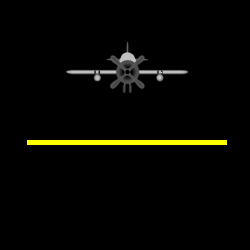

 &nbsp;&nbsp;&nbsp;&nbsp;&nbsp;&nbsp;&nbsp;&nbsp;&nbsp;&nbsp; [ reply.it](https://repl.it/repls/folder/PyGame%20Examples)

---

# Mask

## Surface mask

Related Stack Overflow questions:

- [PyGame collision with masks is not working](https://stackoverflow.com/questions/57455811/pygame-collision-with-masks-is-not-working/57499484#57499484)
- [Collision between masks in PyGame](https://stackoverflow.com/questions/55817422/collision-between-masks-in-pygame/55818093#55818093)  
  

  :scroll: **[Minimal example - Find intersection of surfaces](../../examples/minimal_examples/pygame_minimal_mask_intersect_surface.py)**

- [Check collision between a image and a line](https://stackoverflow.com/questions/58662215/check-collision-between-a-image-and-a-line-pygame/58662648#58662648)  
  

  :scroll: **[Minimal example - Find intersection of surfaces and line](../../examples/minimal_examples/pygame_minimal_mask_intersect_surface_line_1.py)**

- **[Overlap between mask and fired beams in PyGame [AI car model vision]](https://stackoverflow.com/questions/62008457/overlap-between-mask-and-fired-beams-in-pygame-ai-car-model-vision/62082726#62082726)**  
    

  :scroll: **[Minimal example - Find intersection of surface and lines](../../examples/minimal_examples/pygame_minimal_mask_intersect_surface_line_2.py)**

- [How can I rotate my hit box with my rotating and moving car in PyGame?](https://stackoverflow.com/questions/62974678/how-can-i-rotate-my-hitbox-with-my-rotating-and-moving-car-in-pygame/62976825#62976825)

- [How can I rotate my hitbox with my rotating and moving car in pygame?](https://stackoverflow.com/questions/62974678/how-can-i-rotate-my-hitbox-with-my-rotating-and-moving-car-in-pygame/62976825#62976825)

## Sprite mask

See [Sprite, Group and Sprite mask - Sprite mask](pygame_sprite_and_sprite_mask.md)