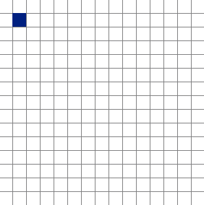

[](https://stackoverflow.com/users/5577765/rabbid76?tab=profile) &nbsp;&nbsp;&nbsp;&nbsp;&nbsp;&nbsp;&nbsp;&nbsp;&nbsp;&nbsp; [ reply.it](https://repl.it/repls/folder/PyGame%20Examples)

---

# Move towards target

## Shoot a bullet in a certain direction - Rotate player and shoot bullet towards faced direction

Related Stack Overflow questions:

- [Why aren't any bullets appearing on screen? - PyGmae](https://stackoverflow.com/questions/59126785/why-arent-any-bullets-appearing-on-screen-pygame)  
  

  :scroll: **[Minimal example - Rotate player and shoot bullet towards faced direction 1](../../examples/minimal_examples/pygame_minimal_rotate_to_target_fire_bullet_1.py)**

- [calculating direction of the player to shoot PyGmae](https://stackoverflow.com/questions/60464828/calculating-direction-of-the-player-to-shoot-pygame/60465212#60465212)  
  

  :scroll: **[Minimal example - Rotate player and shoot bullet towards faced direction 2](../../examples/minimal_examples/pygame_minimal_rotate_to_target_fire_bullet_2.py)**

- [Moving forward after angle change. Pygame](https://stackoverflow.com/questions/61106297/moving-forward-after-angle-change-pygame/61106823#61106823)  
  

## Shoot bullets towards target or mouse

Related Stack Overflow questions:

- **[Shooting a bullet in pygame in the direction of mouse](https://stackoverflow.com/questions/59977052/shooting-a-bullet-in-pygame-in-the-direction-of-mouse/59980344#59980344)**  
  

  :scroll: **[Minimal example - shoot bullet towards mouse](../../examples/minimal_examples/pygame_minimal_move_to_target_fire_bullet_1.py)**

[`pygame.transform.rotate`](https://www.pygame.org/docs/ref/transform.html#pygame.transform.rotate) does not transform the object self, it creates a new rotated surface and returns it.

If you want to fire a bullet in a certain direction, the direction is defined when the bullet spawns, but it does not change continuously.  
Set the start position of the bullet and compute the direction vector to the mouse position:

```py
self.pos = (x, y)
mx, my = pygame.mouse.get_pos()
self.dir = (mx - x, my - y)
```

The direction vector should not depend on the distance to the mouse, it has to be a [Unit vector](https://en.wikipedia.org/wiki/Unit_vector).
Normalize the vector be dividing by the [Euclidean distance](https://en.wikipedia.org/wiki/Euclidean_distance)

```py
length = math.hypot(*self.dir)
if length == 0.0:
    self.dir = (0, -1)
else:
    self.dir = (self.dir[0]/length, self.dir[1]/length)
```

Compute the angle of the vector and rotate the bullet:

```py
angle = math.degrees(math.atan2(-self.dir[1], self.dir[0]))

self.bullet = pygame.Surface((7, 2)).convert_alpha()
self.bullet.fill((255, 255, 255))
self.bullet = pygame.transform.rotate(self.bullet, angle)
```

To update the position of the bullet, it is sufficient to scale the direction (by a velocity) and add it to its position:

```py
self.pos = (self.pos[0]+self.dir[0]*self.speed,
            self.pos[1]+self.dir[1]*self.speed)
```

When you draw the bullet, the get the rectangle of the bullet surface and set the center by `self.pos`

```py
bullet_rect = self.bullet.get_rect(center = self.pos)
surf.blit(self.bullet, bullet_rect)  
```

## Follow target or mouse

### Enemy follow

Related Stack Overflow questions:

- [Pygame: Image chasing the mouse cursor from certain length](https://stackoverflow.com/questions/55168892/pygame-image-chasing-the-mouse-cursor-from-certain-length)

  :scroll: **[Minimal example - Follow target](../../examples/minimal_examples/_pygame_minimal_move_follow_1.py)**

- **[How to make smooth movement in pygame](https://stackoverflow.com/questions/64087982/how-to-make-smooth-movement-in-pygame/64088747?noredirect=1)**  
  

  :scroll: **[Minimal example - Follow target smoothly](../../examples/minimal_examples/pygame_minimal_move_follow_smoothly.py)**

- **[how to make particles follow my mouse in pygame](https://stackoverflow.com/questions/63412401/how-to-make-particles-follow-my-mouse-in-pygame/63412536#63412536)**
- [Sprite follow another flexible way within certain distance limits](https://stackoverflow.com/questions/60064644/sprite-follow-another-flexible-way-within-certain-distance-limits)
- [How can i make a block follow another block in pygame](https://stackoverflow.com/questions/59799575/how-can-i-make-a-block-follow-another-block-in-pygame/59799746#59799746)

For a more sophisticated solution, you've to compute the [Euclidean distance](https://en.wikipedia.org/wiki/Euclidean_distance) form the point to the target.   Use [`pygame.math.Vector2`](https://www.pygame.org/docs/ref/math.html#pygame.math.Vector2) for the computation.

Compute the distance from between the follower and the sprite and the unit direction vector from (`follower_x`, `follower_y`) to (`mainsprite_x`, `mainsprite_y`). The [Unit Vector](https://en.wikipedia.org/wiki/Unit_vector) can be computed by dividing the direction vector by the distance or by normalizing ([`normalize()`](https://www.pygame.org/docs/ref/math.html#pygame.math.Vector2.normalize)) the direction vector:

```py
target_vector = Vector2(mainsprite_x, mainsprite_y)
follower_vector = Vector2(follower_x, follower_y)

distance = follower_vector.distance_to(target_vector)
direction_vector = target_vector - follower_vector
if distance > 0:
    direction_vector /= distance
```

Now you can define an exact `step_distance` and move to follower int direction of the sprite:

```py
if distance > 0:
    new_follower_vector = follower_vector + direction_vector * step_distance.
```

Define a `maximum_distance` and a `minimum_distance`. The minimum step distance is:

```py
min_step = max(0, distance - maximum_distance)
```

The maximum  step distance is

```py
max_step = distance - minimum_distance
```

Put it all together:

```py
minimum_distance    = 0
maximum_distance    = 10000
target_vector       = Vector2(mainsprite_x, mainsprite_y)
follower_vector     = Vector2(follower_x, follower_y)
new_follower_vector = Vector2(follower_x, follower_y)

distance = follower_vector.distance_to(target_vector)
if distance > minimum_distance:
    direction_vector    = (target_vector - follower_vector) / distance
    min_step            = max(0, distance - maximum_distance)
    max_step            = distance - minimum_distance
    step_distance       = min_step + (max_step - min_step) * LERP_FACTOR
    new_follower_vector = follower_vector + direction_vector * step_distance
```

:scroll: **[Minimal example - Follow target smoothly](../../examples/minimal_examples/pygame_minimal_move_follow_smoothly.py)**


:scroll: **[Minimal example - Ball follow ball](../../examples/minimal_examples/pygame_minimal_move_follow_2.py)**


:scroll: **[Minimal example - Object follow target](../../examples/minimal_examples/pygame_minimal_move_follow_3.py)**


