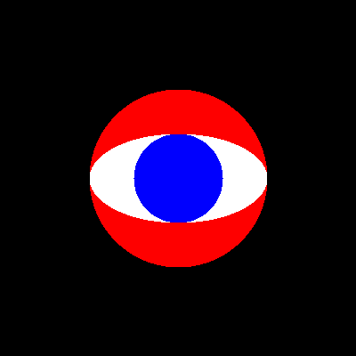

[](https://stackoverflow.com/users/5577765/rabbid76?tab=profile) &nbsp;&nbsp;&nbsp;&nbsp;&nbsp;&nbsp;&nbsp;&nbsp;&nbsp;&nbsp; [ reply.it](https://repl.it/repls/folder/PyGame%20Examples)

---

# Surface and image

## Surface rectangle

Related Stack Overflow questions:

- [Why is my collision test always returning 'true' and why is the position of the rectangle of the image always wrong (0, 0)?](https://stackoverflow.com/questions/57730329/pygame-collide-rect-function-always-returning-true/57730378#57730378)
- [Is there a way to place number on the center of the screen in pygame?](https://stackoverflow.com/questions/62728473/is-there-a-way-to-place-number-on-the-center-of-the-screen-in-pygame/62728692#62728692)#
- [python library pygame: centering text](https://stackoverflow.com/questions/23982907/python-library-pygame-centering-text)  

[`pygame.Surface.get_rect.get_rect()`](https://www.pygame.org/docs/ref/surface.html#pygame.Surface.get_rect) returns a rectangle with the size of the _Surface_ object, that always starts at (0, 0) since a _Surface_ object has no position. The position of the rectangle can be specified by a keyword argument. For example, the center of the rectangle can be specified with the keyword argument `center`. These keyword argument are applied to the attributes of the [`pygame.Rect`](https://www.pygame.org/docs/ref/rect.html) before it is returned (see [`pygame.Rect`](https://www.pygame.org/docs/ref/rect.html) for a full list of the keyword arguments).

[`pygame.Surface.get_rect.get_rect()`](https://www.pygame.org/docs/ref/surface.html#pygame.Surface.get_rect) returns a rectangle with the size of the _Surface_ object, but it returns a rectangle that always starts at (0, 0) since a _Surface_ object has no position.  
The Surface is placed at a position when it is `blit` to the display.  

You've to set the location of the rectangle, either by a keyword argument, e.g:

```py
self.rect = self.image.get_rect(topleft = (self.x, self.y))
```

or an assignment to a virtual attribute (see [`pygame.Rect`](https://www.pygame.org/docs/ref/rect.html)), e.g:

```py
self.rect = self.image.get_rect()
self.rect.topleft = (self.x, self.y)
```

## Surface format and performance

Related Stack Overflow questions:

- [Lag when win.blit() background pygame](https://stackoverflow.com/questions/59312019/lag-when-win-blit-background-pygame/59318946#59318946)
- [Why does my game made with Pygame suddenly lag for a few seconds?](https://stackoverflow.com/questions/60222282/why-does-my-game-made-with-pygame-suddenly-lag-for-a-few-seconds/60222744#60222744)

Call [`convert()`](https://www.pygame.org/docs/ref/surface.html#pygame.Surface.convert) on the background image. That ensures that the image has the same pixel format as the display Surface and will help [`blit`](https://www.pygame.org/docs/ref/surface.html#pygame.Surface.blit) to operate with optimal performance:

```py
screen = pygame.display.set_mode((800, 600))
background = pygame.image.load('background.png').convert()
```

Note, if the surface has a different format than the display, then `blit` has to convert the format on the fly in every frame.

## Transparent surface and color key

Related Stack Overflow questions:

- [How do I blit a PNG with some transparency onto a surface in Pygame?](https://stackoverflow.com/questions/1634208/how-do-i-blit-a-png-with-some-transparency-onto-a-surface-in-pygame/64630678#64630678)  
  

  :scroll: **[Minimal example - Load transparent image](../../examples/minimal_examples/pygame_minimal_surface_load_2.py)**

  <kbd>[ repl.it/@Rabbid76/PyGame-LoadTransparentImage](https://repl.it/@Rabbid76/PyGame-LoadTransparentImage#main.py)</kbd>

### Make a uniform colored background transparent

Related Stack Overflow questions:

- [How can I make an Image with a transparent Backround in Pygame?](https://stackoverflow.com/questions/62623341/how-can-i-make-an-image-with-a-transparent-backround-in-pygame/62623422#62623422)
- [How to convert the background color of image to match the color of Pygame window?](https://stackoverflow.com/questions/63976450/how-to-convert-the-background-color-of-image-to-match-the-color-of-pygame-window/63976738#63976738)  
  
- [pygame image background does not match main background](https://stackoverflow.com/questions/62689244/pygame-image-background-does-not-match-main-background/62689442#62689442)
- [How do I make the screen ignore the background color of some image?](https://stackoverflow.com/questions/55648488/how-do-i-make-the-screen-ignore-the-background-color-of-some-image/55654549#55654549)
- [Pygame image transparency confusion](https://stackoverflow.com/questions/64704789/pygame-image-transparency-confusion/64704923#64704923)

Most likely, your image is not transparent at all. The transparency is stored in the alpha value. Compared to JPG and BMP, the PNG and GIF formats offer an alpha value per pixel. Converting an image to PNG or GIF format does not make an image transparent. You need to paint or download a transparent image. 

The pygame documentation notes that:

> The returned Surface will contain the same color format, colorkey and alpha transparency as the file it came from. You will often want to call [`convert()`](https://www.pygame.org/docs/ref/surface.html#pygame.Surface.convert) with no arguments, to create a copy that will draw more quickly on the screen.  
> For alpha transparency, like in .png images, use the [`convert_alpha()`](https://www.pygame.org/docs/ref/surface.html#pygame.Surface.convert_alpha) method after loading so that the image has per pixel transparency.

Hence if your image provides per pixel alpha,  it is recommended that you call `convert_alpha()`, but this is not required.

If your image has not transparent pixel, but a uniform colored background, set a transparent color key with [`set_colorkey()`](https://www.pygame.org/docs/ref/surface.html#pygame.Surface.set_colorkey)

The color key specifies the color that is treated as transparent. For example, if you have an image with a black background that should be transparent, set a black color key:

```py
my_surface.set_colorkey((0, 0, 0))
```

### Create transparent Surface

Related Stack Overflow questions:

- [How to make a surface with a transparent background in pygame](https://stackoverflow.com/questions/328061/how-to-make-a-surface-with-a-transparent-background-in-pygame/64512639#64512639)  

You have 3 possibilities:

- Set a transparent color key with [`set_colorkey()`](https://www.pygame.org/docs/ref/surface.html#pygame.Surface.set_colorkey)

  The color key specifies the color that is treated as transparent. For example, if you have an image with a black background that should be transparent, set a black color key:

  ```py
  my_surface.set_colorkey((0, 0, 0))
  ```

- You can enable additional functions when creating a new surface. Set the [`SRCALPHA`](https://www.pygame.org/docs/ref/surface.html) flag to create a surface with an image format that includes a per-pixel alpha. The initial value of the pixels is (0, 0, 0, 0):

  ```py
  my_surface = pygame.Surface((width, height), pygame.SRCALPHA)
  ```

- Use [`convert_alpha()`](https://www.pygame.org/docs/ref/surface.html#pygame.Surface.convert_alpha) to create a copy of the _Surface_ with an image format that provides alpha per pixel.

  However, if you create a new surface and use `convert_alpha()`, the alpha channels are initially set to maximum. The initial value of the pixels is (0, 0, 0, 255). You need to fill the entire surface with a transparent color before you can draw anything on it:

  ```py
  my_surface = pygame.Surface((width, height))
  my_surface = my_surface.convert_alpha()
  my_surface.fill((0, 0, 0, 0))
  ```

You don't need to change the background color of the image to the background color of the window, but make the background of the image transparent.

Set the transparent color key by [`pygame.Surface.set_colorkey`](https://www.pygame.org/docs/ref/surface.html#pygame.Surface.set_colorkey):

> Set the current color key for the Surface. When blitting this Surface onto a destination, any pixels that have the same color as the colorkey will be transparent.

The white artifacts you can see in the picture are caused because the [JPG](https://en.wikipedia.org/wiki/JPEG) format is a compressed format.  
The compression is not lossless. This means the colors around the weapon are not  exactly white (255, 255, 255). The color appear to be white for the human eye, but actually the color channels have a value lass than 255, but near to 255.  

You can try to correct this manually. Ensure that format of the image has an alpha channel by [`pygame.Surface.convert_alpha()`](https://www.pygame.org/docs/ref/surface.html#pygame.Surface.convert_alpha). Identify all the pixel, which have a red green and blue color channel above a certain threshold (e.g. 230). Change the color channels and the alpha channel of those pixels to (0, 0, 0, 0):

```py
img = pygame.image.load(IMAGE).convert_alpha()

threshold = 230
for x in range(img.get_width()):
    for y in range(img.get_height()):
        color = img.get_at((x, y))
        if color.r > threshold and color.g > threshold and color.b > threshold:
            img.set_at((x, y), (0, 0, 0, 0))
```

Of course you are in danger to change pixels which you don't want to change to. If the weapon would have some very "bright" areas, then this areas my become transparent, too.

Note, an issue like this can be avoided by using a different image format like [BMP](https://en.wikipedia.org/wiki/BMP_file_format) or [PNG](https://de.wikipedia.org/wiki/Portable_Network_Graphics).  
With this formats the pixel can be stored lossless.
You can try to "photo shop" the image. Manually change the pixel around the weapon and store the image with a different format.

## Negative image

Related Stack Overflow questions:

- [PyGame Negative Color / Surface](https://stackoverflow.com/questions/63665826/pygame-negative-color-surface/63665904#63665904)

## Floating point

Related Stack Overflow questions:

- [How to fix this DeprecationWarning](https://stackoverflow.com/questions/59336922/how-to-fix-this-deprecationwarning/59336966#59336966)
- [Using a function closes pygame window](https://stackoverflow.com/questions/60474292/using-a-function-closes-pygame-window/60474405#60474405)
- [Invalid destination position for blit error](https://stackoverflow.com/questions/63582946/invalid-destination-position-for-blit-error/63583200#63583200)

## Load image

Related Stack Overflow questions:

- [What is a good way to draw images using pygame?](https://stackoverflow.com/questions/8873219/what-is-a-good-way-to-draw-images-using-pygame/64630591#64630591)
- [How do I blit a PNG with some transparency onto a surface in Pygame?](https://stackoverflow.com/questions/1634208/how-do-i-blit-a-png-with-some-transparency-onto-a-surface-in-pygame/64630678#64630678)

Images are represented by ["pygame.Surface"](https://www.pygame.org/docs/ref/surface.html) objects. A _Surface_ can be created from an image with [`pygame.image.load`](https://www.pygame.org/docs/ref/image.html):

```py
my_image_surface = pygame.load.image('my_image.jpg')
```

However, the pygame documentation notes that:

> The returned Surface will contain the same color format, colorkey and alpha transparency as the file it came from. You will often want to call [`convert()`](https://www.pygame.org/docs/ref/surface.html#pygame.Surface.convert) with no arguments, to create a copy that will draw more quickly on the screen.  
> For alpha transparency, like in .png images, use the [`convert_alpha()`](https://www.pygame.org/docs/ref/surface.html#pygame.Surface.convert_alpha) method after loading so that the image has per pixel transparency.

Use the appropriate conversion method for best performance:

```py
image_surface = pygame.load.image('my_image.jpg').convert()
```

```py
alpha_image_surface = pygame.load.image('my_icon.png').convert_alpha()
```

A _Surface_ can be drawn on or blended with another _Surface_ using the [`blit`](https://www.pygame.org/docs/ref/surface.html#pygame.Surface.blit) method. The first argument to blit is the _Surface_ that should be drawn. The second argument is either a tuple (_x_, _y_) representing the upper left corner or a rectangle. With a rectangle, only the upper left corner of the rectangle is taken into account. It should be mentioned that the window respectively display is also represented by a _Surface_. Therefore, drawing a _Surface_ in the window is the same as drawing a _Surface_ on a _Surface_:

```py
window_surface.blit(image_surface, (x, y))
```

```py
window_surface.blit(image_surface,
    image_surface.get_rect(center = window_surface.get_rect().center))
```

:scroll: **[Minimal example - Load image](../../examples/minimal_examples/pygame_minimal_surface_load_1.py)**


:scroll: **[Minimal example - Load transparent image](../../examples/minimal_examples/pygame_minimal_surface_load_2.py)**

<kbd>[ repl.it/@Rabbid76/PyGame-LoadTransparentImage](https://repl.it/@Rabbid76/PyGame-LoadTransparentImage#main.py)</kbd>


### Image load performance (lagging)

Related Stack Overflow questions:

- [Pygame is running slow](https://stackoverflow.com/questions/61134825/pygame-is-running-slow/61134941#61134941)
- [Why my pygame game with a tiled map is lagging?](https://stackoverflow.com/questions/62136440/why-my-pygame-game-with-a-tiled-map-is-lagging/62137296#62137296)

### Load Pillow image

Related Stack Overflow questions:

- [PIL and pygame.image](https://stackoverflow.com/questions/25202092/pil-and-pygame-image)

```py
def pilImageToSurface(pilImage):
    return pygame.image.fromstring(
        pilImage.tobytes(), pilImage.size, pilImage.mode).convert()
```

:scroll: **[Minimal example - Load PIL image to PyGame _Surface_](../../examples/minimal_examples/pygame_minimal_surface_load_from_pil.py)**

### Load OpenCV (cv2) image

Related Stack Overflow questions:

- [How do I convert an OpenCV (cv2) image (BGR and BGRA) to a pygame.Surface object](https://stackoverflow.com/questions/64183409/how-do-i-convert-an-opencv-cv2-image-bgr-and-bgra-to-a-pygame-surface-object/64183410#64183410)  
  
- [Temporary save Image in pygame](https://stackoverflow.com/questions/64410240/temporary-save-image-in-pygame/64410622#64410622)
- [Pygame, create grayscale from 2d numpy array](https://stackoverflow.com/questions/40755989/pygame-create-grayscale-from-2d-numpy-array)

#### How do I convert an OpenCV (cv2) image (BGR and BGRA) to a pygame.Surface object

The `shape` attribute of a [`numpy.array`](https://numpy.org/doc/stable/reference/generated/numpy.array.html) is the number of elements in each dimension. The first element is the height, the second the width and the third the number of channels.  
A [`pygame.Surface`](https://www.pygame.org/docs/ref/surface.html) can be generated by [`pygame.image.frombuffer`](https://www.pygame.org/docs/ref/image.html#pygame.image.frombuffer). The 1st argument can be a `numpy.array` and the 2nd argument is the format (`RGB` or `RGBA`).

Get the size (_widht_, _height_) for the `pygame.Surface` object by slicing:

```py
size = cv2Image.shape[1::-1]
```

Determine the target format for the `pygame.Surface` object, depending on the third channel:

```py
format = 'RGBA' if cv2Image.shape[2] == 4 else 'RGB'
```

Since the source format is _BGR_ or _BGRA_, but the target format is _RGB_ or _RGBA_, the red and blue channels have to be swapped:

```py
cv2Image[:, :, [0, 2]] = cv2Image[:, :, [2, 0]]
```

In the case of a grayscale image, the shape of the array must be changed using [`numpy.reshape`](https://numpy.org/doc/stable/reference/generated/numpy.reshape.html) and the gray channel must be expanded to a red-green and blue color channel using [`numpy.repeat`](https://numpy.org/doc/stable/reference/generated/numpy.repeat.html):

```py
cv2Image = np.repeat(cv2Image.reshape(size[1], size[0], 1), 3, axis = 2)
```

With his data the `pygame.Surface` object can be generated by `pygame.image.frombuffer`:

```py
surface = pygame.image.frombuffer(cv2Image.flatten(), size, format)
```

To ensure that the image has the same pixel format as the display _Surface_ and for optimal performance, the _Surface_ should be converted with either [`convert`](https://www.pygame.org/docs/ref/surface.html#pygame.Surface.convert) or [`convert_alpha`](https://www.pygame.org/docs/ref/surface.html#pygame.Surface.convert_alpha):

```py
surface = surface.convert_alpha() if format == 'RGBA' else surface.convert()
```

Complete function `cv2ImageToSurface`:

```py
def cv2ImageToSurface(cv2Image):
    if cv2Image.dtype.name == 'uint16':
        cv2Image = (cv2Image / 256).astype('uint8')
    size = cv2Image.shape[1::-1]
    if len(cv2Image.shape) == 2:
        cv2Image = np.repeat(cv2Image.reshape(size[1], size[0], 1), 3, axis = 2)
        format = 'RGB'
    else:
        format = 'RGBA' if cv2Image.shape[2] == 4 else 'RGB'
        cv2Image[:, :, [0, 2]] = cv2Image[:, :, [2, 0]]
    surface = pygame.image.frombuffer(cv2Image.flatten(), size, format)
    return surface.convert_alpha() if format == 'RGBA' else surface.convert()
```

:scroll: **[Minimal example - Load cv2 image to PyGame _Surface_](../../examples/minimal_examples/pygame_minimal_surface_load_from_cv2.py)**


### Load SVG

[Scalable  Vector Graphics (SVG)](https://de.wikipedia.org/wiki/Scalable_Vector_Graphics)

Related Stack Overflow questions:

- [SVG rendering in a PyGame application](https://stackoverflow.com/questions/120584/svg-rendering-in-a-pygame-application)

[pynanosvg](https://github.com/ethanhs/pynanosvg) can be used to load and rasterize [Vector Graphics (SVG)](https://de.wikipedia.org/wiki/Scalable_Vector_Graphics) files. Install [_Cython_](v) and _pynanosvg_:

```lang-none
pip install Cython
pip install pynanosvg
```

The SVG file can be read, rasterized and loaded into a [`pygame.Surface`](https://www.pygame.org/docs/ref/surface.html) object with the following function:

```py
def load_svg(filename, scale=None, size=None, clip_from=None, fit_to=None, foramt='RGBA'):
    svg = Parser.parse_file(filename)
    scale = min((fit_to[0] / svg.width, fit_to[1] / svg.height) if fit_to else ([scale if scale else 1] * 2))
    width, height = size if size else (svg.width, svg.height)
    surf_size = round(width * scale), round(height * scale)
    buffer = Rasterizer().rasterize(svg, *surf_size, scale, *(clip_from if clip_from else 0, 0))
    return  pygame.image.frombuffer(buffer, surf_size, foramt)
```

:scroll: **[Minimal example - Load Scalable Vector Graphics (SVG) to PyGame _Surface_](../../examples/minimal_examples/pygame_minimal_surface_load_svg_1.py)**

### Load animated GIF

- [How can I load an animated GIF and get all of the individual frames in PyGame?](https://stackoverflow.com/questions/29571399/how-can-i-load-an-animated-gif-and-get-all-of-the-individual-frames-in-pygame)
- [How do I make a sprite as a gif in pygame?](https://stackoverflow.com/questions/64179680/how-do-i-make-a-sprite-as-a-gif-in-pygame/64182074#64182074)

[PyGame](https://www.pygame.org/news) respectively the [`pygame.image`](https://www.pygame.org/docs/ref/image.html) module can only handle non-animated [GIFs](https://en.wikipedia.org/wiki/GIF).  
But on the PyGame homepage is introduced the [GIFImage](https://www.pygame.org/project-GIFImage-1039-.html) library:

> This library adds GIF animation playback to pygame.

Another option is to use a library to load the GIF frame by frame to a list.

For instance use the [Pillow](https://pillow.readthedocs.io/en/stable/) library ([_pip install Pillow_](https://pypi.org/project/Pillow/)).

Write a function, that can convert a PIL image to a [`pygame.Surface`](https://www.pygame.org/docs/ref/surface.html) and use the PIL library to load a GIF frame by frame:  
(see also [Extracting The Frames Of An Animated GIF Using Pillow](https://pythontic.com/image-processing/pillow/extract%20frames%20from%20animated%20gif) and [PIL and pygame.image](https://stackoverflow.com/questions/25202092/pil-and-pygame-image))  

```py
from PIL import Image, ImageSequence
```

```py
def pilImageToSurface(pilImage):
    mode, size, data = pilImage.mode, pilImage.size, pilImage.tobytes()
    return pygame.image.fromstring(data, size, mode).convert_alpha()

def loadGIF(filename):
    pilImage = Image.open(filename)
    frames = []
    if pilImage.format == 'GIF' and pilImage.is_animated:
        for frame in ImageSequence.Iterator(pilImage):
            pygameImage = pilImageToSurface(frame.convert('RGBA'))
            frames.append(pygameImage)
    else:
        frames.append(pilImageToSurface(pilImage))
    return frames
```

Or use [OpenCV](https://opencv.org/)/[_opencv-python_](https://pypi.org/project/opencv-python/) library and [`VideoCapture`](https://docs.opencv.org/master/d8/dfe/classcv_1_1VideoCapture.html)

Write a function, that can convert a cv2 [`pygame.image`](https://www.pygame.org/docs/ref/image.html) image to a [`pygame.Surface`](https://www.pygame.org/docs/ref/surface.html) a nd use the library to load a GIF frame by frame:  
(see also [Read GIF files in Python](https://www.facebook.com/MLandDS/posts/read-gif-files-in-pythonimport-cv2from-pil-import-imagegif-cv2videocapturemy_fil/2397352997206918/) and [How do I convert an OpenCV (cv2) image (BGR and BGRA) to a pygame.Surface object](https://stackoverflow.com/questions/64183409/how-do-i-convert-an-opencv-cv2-image-bgr-and-bgra-to-a-pygame-surface-object/64183410#64183410))  

```py
import cv2
```

```py
def cv2ImageToSurface(cv2Image):
    size = cv2Image.shape[1::-1]
    format = 'RGBA' if cv2Image.shape[2] == 4 else 'RGB'
    cv2Image[:, :, [0, 2]] = cv2Image[:, :, [2, 0]]
    surface = pygame.image.frombuffer(cv2Image.tostring(), size, format)
    return surface.convert_alpha() if format == 'RGBA' else surface.convert()

def loadGIF(filename):
    gif = cv2.VideoCapture(filename)
    frames = []
    while True:
        ret, cv2Image = gif.read()
        if not ret:
            break
        pygameImage = cv2ImageToSurface(cv2Image)
        frames.append(pygameImage)
    return frames
```

:scroll: **[Minimal example - Load animated GIF PyGame _Surface_ list using cv2](../../examples/minimal_examples/pygame_minimal_surface_load_frames_gif_cv2.py)**

:scroll: **[Minimal example - Load animated GIF PyGame _Surface_ list using PLI](../../examples/minimal_examples/pygame_minimal_surface_load_frames_gif_pil.py)**


Use the list of `pygame.Surface` objects to generate a [Spritesheet](https://www.pygame.org/wiki/Spritesheet).

### Load frames from NumPy array

Related Stack Overflow questions:

- [Pygame and Numpy Animations](https://stackoverflow.com/questions/54415196/pygame-and-numpy-animations)

Load multiple frames (`data`) of 8-bit BGRA images of shape _(y, x, 4, k)_ to a list of [`pygame.Surface`](https://www.pygame.org/docs/ref/surface.html) objects:

```py
surf_list = [pygame.image.frombuffer(d[:,:,[2, 1, 0, 3]].flatten(), (data.shape[1::-1]), 'RGBA') for d in data.transpose(3, 0, 1, 2)]
```

respectively

```py
surf_list = []
for d in data.transpose(3, 0, 1, 2):
    bytes = d[:,:,[2, 1, 0, 3]].flatten()
    size = data.shape[1::-1]
    format = 'RGBA'
    surface = pygame.image.frombuffer(bytes, size, format)
    surf_list.append(surface)
```

Explanation:

Use [`numpy.traspose`](https://numpy.org/doc/stable/reference/generated/numpy.transpose.html) to bring the 3rd (frame) axis moving axis 2 to the front (see [Iterating over arbitrary dimension of numpy.array](https://stackoverflow.com/questions/1589706/iterating-over-arbitrary-dimension-of-numpy-array)) and iterate through the frames:

```py
for d in data.transpose(3, 0, 1, 2):
```

Create a [`pygame.Surface`](https://www.pygame.org/docs/ref/surface.html) from each frame by [`pygame.image.frombuffer()`](https://www.pygame.org/docs/ref/image.html#pygame.image.frombuffer):

```py
surface = pygame.image.frombuffer(bytes, size, format)
```

[`pygame.image.frombuffer()`](https://www.pygame.org/docs/ref/image.html#pygame.image.frombuffer) has 3 arguments, _bytes_, _size_, _format_. _bytes_ is the 1 dimensional byte array of pixel data. [`numpy.ndarray.flatten`](https://numpy.org/doc/stable/reference/generated/numpy.ndarray.flatten.html) return a copy of the array collapsed into one dimension. Most likely the order of the color channels is _BGRA_ rather than _RGBA_. Hence you have to swap the red and blue color channel (`d[:,:,[2, 1, 0, 3]]`). You can skip this if the order of the color channels is _RGBA_:

```py
bytes = d[:,:,[2, 1, 0, 3]].flatten() # for BGRA
```

```py
bytes = d.flatten() # for RGBA
```

_size_ is a tuple with 2 elements (_x_, _y_) and specifies the size of the image. The size can be get form [`numpy.ndarray.shape`](https://numpy.org/doc/stable/reference/generated/numpy.ndarray.shape.html):

```py
size = data.shape[1::-1]
```

or

```py
size = (data.shape[1], data.shape[0])
```

_format_ specifies the image format and has to be `'RGBA'` (`'BGRA'` doesn't exist):

```py
format = 'RGBA'
```

:scroll: **[Minimal example - Load frames from NumPy array](../../examples/minimal_examples/pygame_minimal_surface_load_frames_numpy.py)**



## Pixel array

Related Stack Overflow questions:

- [Speed up double for loop PyGame draw](https://stackoverflow.com/questions/61856330/speed-up-double-for-loop-pygame-draw/61856399#61856399)

## Surface lock

Related Stack Overflow questions:

- [How do I save a section of a pygame screen and blit it to another location?](https://stackoverflow.com/questions/56420746/how-do-i-save-a-section-of-a-pygame-screen-and-blit-it-to-another-location/56421239#56421239)
